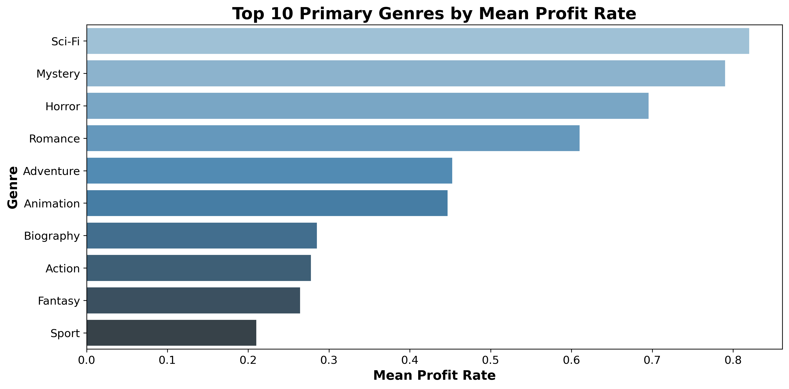
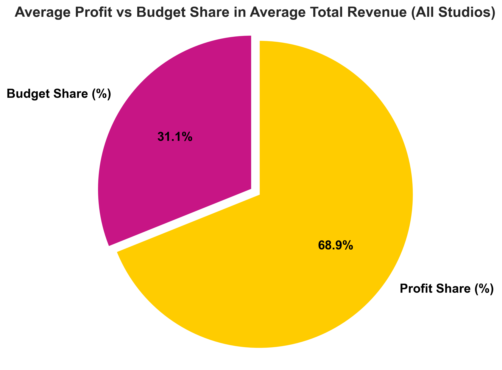
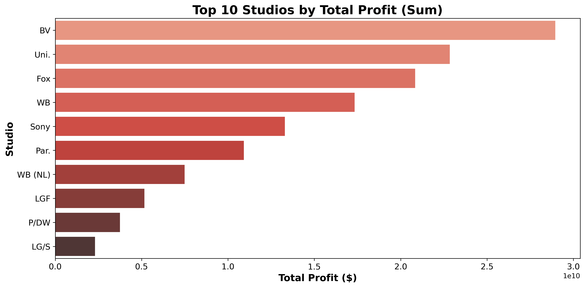
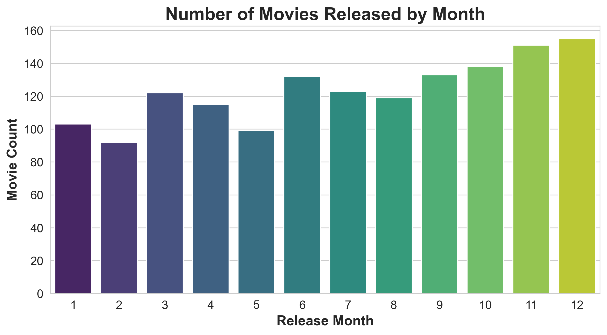
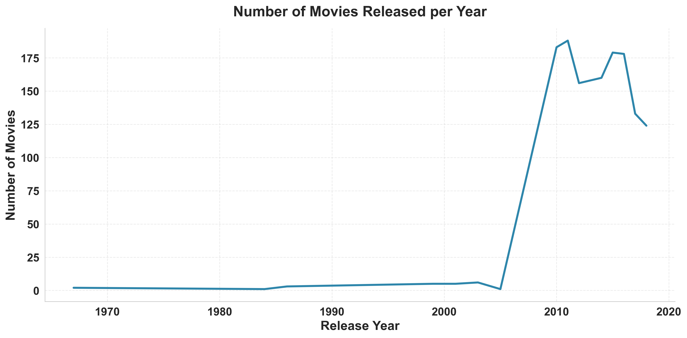
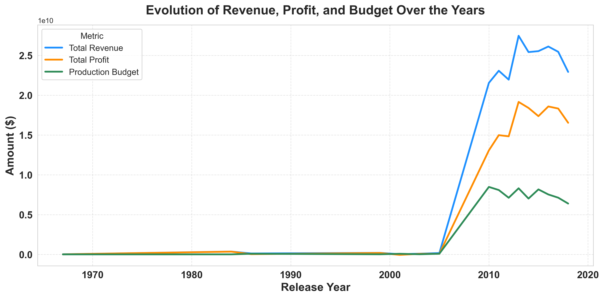

# Movie Insights - Project
## Movie-Insights: A Data Science Study of High-Performing Movies at the Box Office


**Author:** [Vilmarson JULES](mailto:vilmarsonjules22@gmail.com)

## Overview
---
The goal of this project is to identify which types of films are performing best at the box office. Using exploratory data analysis and clear visualizations, key insights are provided to help stakeholders understand current trends. Additionally, three actionable business recommendations guide the decision-making for a new movie studio.

Then this work is intended to :
1. Identify top-performing films 
2. Reveal trends and patterns in box office performance


## Business Problem
---

 

Inspired by the success of other companies in original video content, the company aims to launch a new movie studio.  

As a data scientist, the task is to determine **which types of films perform best at the box office** and translate these findings into actionable insights. These insights will guide the studio head in making informed decisions about which films to produce.
    
## The Data

The movie datasets for this project were collected from multiple sources:  

* [Box Office Mojo](https://www.boxofficemojo.com/)  
* [IMDB](https://www.imdb.com/)  
* [Rotten Tomatoes](https://www.rottentomatoes.com/)  
* [TheMovieDB](https://www.themoviedb.org/)  
* [The Numbers](https://www.the-numbers.com/)  

All datasets are in CSV format, except IMDB, which is stored in a SQLite database. 
The image below shows the overall structure of the IMDB database:


## Methods
---
This project used Python and SQL within Jupyter Notebook, alongside Git/GitHub for version control. Key libraries included Pandas, Matplotlib, Seaborn, Scipy, and Statsmodels.

The methodology involved:

- Data Cleaning & Preparation: Structuring and preparing datasets for analysis.
- Descriptive Analysis & Visualization: Summarizing patterns and trends using statistics and visualizations.
- Diagnostic & Inferential Analysis: Testing relationships and hypotheses to generate actionable insights.


## Business Understanding
---


This project supports data-driven decisions for a company entering the original video content sector.  
**Objective:** Identify which types of films are performing best at the box office.  
By analyzing these patterns, the head of the new movie studio can:  
- Identify the most profitable film types to produce.  
- Develop a roadmap for launching successful movie projects.


## Analysis and Results
---

The analysis that reveales key insights for assessing investment in this sector :

The following section presents statistically-supported insights into box office performance, profitability, and trends, providing a foundation for data-driven decisions by the new studio.

### 1. Genre Profitability and Performance

SCI-FI and MYSTERY genres achieve the highest profit rates (~80%), while ACTION, despite being the most frequent genre, yields a lower profit rate (~30%).

Analysis reveals highly significant differences in revenue and profit across genres (ANOVA diagnostics confirm variation is not by chance).



Less profitable genres may still be pursued selectively, using smaller budgets or targeted marketing to mitigate risk.

This insight helps the new studio prioritize high-performing genres while managing financial exposure on other genres.


### 2. Revenue Composition and Profit Margins 

On average, 31% of total revenue is allocated to production budgets, while 69% constitutes profit, indicating the sector’s high inherent profitability.
This composition shows that the movie industry is highly lucrative, allowing studios to recover costs and generate significant returns on investment.


Careful budgeting and project selection can maximize profitability while controlling financial risk, particularly for mid-tier productions.

### 3. Top Studio Performance

Certain studios, such as BV, Uni., and Fox, consistently achieve profit margins close to or exceeding 70% of revenue, often more than twice the industry average.
Analysis indicates these studios are market leaders, leveraging scale, experience, and optimized operations to achieve superior results. 



The new studio can learn from these top performers, emulate efficient practices, and consider strategic collaborations or partnerships to accelerate growth and reduce competitive risk.

### 4. Seasonal Trends in Movie Releases

Movie release patterns exhibit highly significant seasonality, with peaks in November and December (~150 movies each) and secondary peaks in summer months.



Understanding these trends allows the studio to schedule releases strategically, targeting periods of high audience engagement and maximizing revenue potential.

### 5. Historical Revenue and Profit Trends

- Movie Releases per Year

Analysis of yearly movie releases shows fluctuations in production volume, with peaks in 2015 and 2016 (179 and 178 movies respectively) and lower output in early years (e.g., 5–6 movies in 1999–2003).

Recent years (2010–2018) demonstrate a steady production of 124–188 movies per year, reflecting the industry’s maturation and consistent content output.

 
Understanding these release patterns helps the studio anticipate annual workload, production capacity, and competitive scheduling, ensuring films are launched when audience attention is highest.

- Yearly Revenue, Budget, and Profit Trends

Across 2010–2018, total revenue consistently exceeds production budgets, This highlight strong profitability across years.

The byear 2016 shows the highest revenue ($2.61×10¹⁰) and profit ($1.86×10¹⁰) despite a production budget of $7.53×10⁹, demonstrating effective allocation of resources.
 

Monitoring these trends enables data-driven budgeting, aligning production scale with revenue potential, and maximizing profit margins year over year.
Moreover, these trends helps anticipate market dynamics, plan production schedules effectively, and align projects with high-demand periods to optimize financial outcomes.


## Business Recommendations

### 1. Focus Production on High-Revenue Genres :

Prioritize high-profit genres like Sci-Fi, Mystery, Horror, and Romance to maximize box office performance. Less profitable but frequently produced genres, such as Action and Drama, can be considered selectively with smaller budgets or targeted marketing to manage risk.

### 2. Learn from Industry Leaders and Pursue Strategic Partnerships :

Study strategies of top studios like BV, Uni., and Fox to allocate resources efficiently toward high-profit projects. Consider partnerships or co-productions with established studios to gain market insight, share risk, and build credibility while navigating a competitive landscape.

### 3. Maximize Profitability Through Efficient Budget Planning :
With only 31.1% of revenue spent on production and 68.9% as profit, the movie sector is highly profitable. Plan budgets efficiently, prioritizing projects with high expected returns to maintain strong margins while minimizing financial risk.


## Conclusion
---

This analysis offers a clear view of the movie industry’s trends, performance, and profitability, providing actionable insights for the new studio.

### Key takeaways :

High-revenue genres lead profits: SCI-FI, Mystery, and Horror deliver the strongest returns, while frequently produced genres like Action show lower efficiency. Prioritize top-performing genres and manage lower-profit genres strategically.

Top studios outperform consistently: Studios such as BV, Uni., and Fox achieve significantly higher profits. Learning from their practices and exploring strategic partnerships can reduce risk and improve outcomes.

Seasonal timing matters: Movie releases peak in November, December, and summer months. Aligning releases with these periods can boost audience engagement and revenue.

Industry is highly profitable: With only ~31% of revenue spent on production budgets, the sector offers strong margins. Efficient budgeting can maximize returns.

In summary, the new studio can achieve success by combining data-driven genre selection, strategic resource allocation, optimized budgeting, and seasonal timing, enabling informed, high-return decisions in a competitive market.

## Next Steps
---

- Monitor performance data: Continuously track box office revenue, profit, and audience ratings to validate trends by genre and studio performance.

- Implement predictive modeling: Develop forecasting models for revenue and profit using genre, studio, production budget, and seasonal patterns to guide strategic production decisions.

- Pursue strategic partnerships: Explore co-productions or alliances with top-performing studios (BV, Uni., Fox) to leverage industry expertise and reduce market entry risk.

- Optimize release scheduling and marketing: Align movie releases with peak months (November, December, summer) and tailor marketing campaigns to maximize audience engagement and revenue.

- Diversify genre portfolio strategically: Prioritize high-profit genres (SCI-FI, MYSTERY) while selectively testing less profitable but popular genres (e.g., ACTION) using smaller budgets or targeted marketing to manage risk.

- Track key performance metrics: Establish KPIs for revenue, profit rate, and audience engagement to evaluate decisions, optimize resource allocation, and refine strategies over time.

## Full Analysis & Contact
---
Explore the complete analytical workflow in the [Jupyter Notebook](./movie_index.ipynb) or review the [presentation slides](./movie_presentation.pdf) for a high-level summary key findings and actionable recommendations.

For professional inquiries, collaboration opportunities, or discussions about the methodology and insights, reach out to:

**Vilmarson JULES**  
Data Science & AI Student  
📧 [vilmarsonjules22@gmail.com](mailto:vilmarsonjules22@gmail.com)  


## Repository Structure

```

├── ZippedData
├── Images
├── README.md
├── movie_presentation.pdf
└── movie_index.ipynb
```
